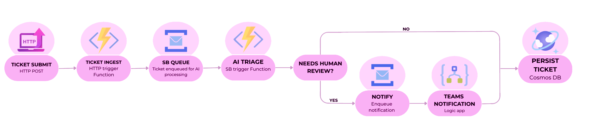

# Ticket Triage AI – Documentation

## Project Overview

Ticket Triage AI is a cloud-based application that automates the classification and prioritization of support tickets using AI.  
The system processes incoming tickets through an event-driven pipeline, where each request is analyzed and enriched with structured metadata such as category, severity, and confidence score.

---

## Key Features

- AI-powered ticket classification (category, severity, confidence score)  
- Event-driven processing pipeline using Azure Service Bus  
- Asynchronous and scalable architecture  
- Persistent storage with Azure Cosmos DB  
- Web dashboard for ticket submission and visualization  
- Monitoring and logging with Application Insights  

---

## Data Flow

- User submits a ticket from the dashboard  
- The request is validated by the Ingest API  
- The ticket is sent to Azure Service Bus  
- A processor function consumes the message  
- The ticket is classified using Azure OpenAI  
- The result is stored in Cosmos DB  
- If the confidence score is low or the ticket requires attention, a message is sent to a review queue  
- A Logic App processes the review request and sends a notification to Microsoft Teams  

---

## Design Choices

**Event-driven architecture**  
Decouples ingestion, processing, and notification workflows, improving scalability and flexibility  

**Serverless functions**  
Enable automatic scaling and reduce infrastructure management  

**Service Bus**  
Provides reliable messaging, buffering, and supports multiple processing stages (including human-in-the-loop review)  

**AI integration**  
Automates classification while allowing fallback to human review when confidence is low  

**Logic App for notifications**  
Separates business logic from communication workflows and enables easy integration with external systems like Microsoft Teams  

---

## Implementation Notes

**Dependency Injection**  
Services are registered through dependency injection to keep the application modular, testable, and easy to extend  

**Factory pattern**  
Factories are used to create normalized messages and persistence models, keeping transformation logic separated from the processing flow  

**Validation layer**  
Incoming requests are validated before entering the pipeline to ensure data consistency and reduce invalid processing  

**Global exception middleware**  
A middleware handles unhandled exceptions centrally, improving error management and observability  

**Correlation IDs**  
Correlation IDs are propagated across the pipeline to support end-to-end tracing and debugging  

**Human-in-the-loop review**  
Low-confidence classifications are routed to a review workflow through Service Bus, Logic App, and Microsoft Teams  

**Dead-letter handling**  
Failed messages can be moved to a dead-letter flow for reliability and failure tracking  